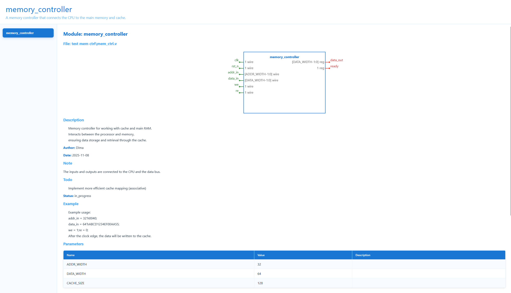

# COGENT

## About the software

**COGENT** is a console software tool aimed to help IC designers who work with HDL code to generate their documentation from the HDL source files.

For the code listed below see the result.

```v
/** @brief 
Memory controller for working with cache and main RAM.
Interacts between the processor and memory,
ensuring data storage and retrieval through the cache.
**/
 
//* @author Dima

//* @date 2025-11-08
//* @top A memory controller that connects the CPU to the main memory and cache.
module memory_controller
#(
    parameter ADDR_WIDTH = 32,
    parameter DATA_WIDTH = 64,
    parameter CACHE_SIZE = 128
)
(
    //* @note The inputs and outputs are connected to the CPU and the data bus.
    input  wire                  clk,        //* Clock signal
    input  wire                  rst_n,      //* Reset (active low)
    input  wire [ADDR_WIDTH-1:0] addr_in,    //* Address entry
    input  wire [DATA_WIDTH-1:0] data_in,    //* Data entry
    output reg  [DATA_WIDTH-1:0] data_out,   //* Data output
    input  wire                  we,         //* Recording signal
    input  wire                  re,         //* Read signal
    output reg                   ready       //* Readiness flag
);

reg [DATA_WIDTH-1:0] cache [0:CACHE_SIZE-1];
reg [ADDR_WIDTH-1:0] tags_mem [0:CACHE_SIZE-1];
reg valid [0:CACHE_SIZE-1];
integer i;

//* @todo Implement more efficient cache mapping (associative)
//* @status in_progress
...
endmodule
```



## How to compile

#### Under MS Windows

For the MS Windows OS we provide the Visual Studio 2022 solution file. 
Just open the ``COGENT\msvs2022`` folder and load the ``COGENT.sln`` solution file.

#### Under Linux

For those who use Linux the Makefile is provided. Find it in the ``COGENT\build`` folder.

## How to run the software

To run the software you should the options as it shown in the table below:

| Required | Short | Full     | Description | Usage |
|  :---:   | :---: |   :---:  |    :---    | :---:  |
| `Yes`    | `-p`  |`--path`  | The path to the input files folder. | `--path <path>` |
| `No`     | `-s`  |`--style` | The style of the theme, possible values are: `light` and `dark`.<br/>By default the `dark` style is used. | `--style <light\|dark>`|
| `No`     | `-f`  |`--format`| The format of the result document. Possible values will be `html`, `markdown` and `asciidoc`. | `--format <html\|{md\|markdown}\|{adoc\|asciidoc}>`|
| `No`     | `-h`  |`--help`  | The help message will be shown. | `--help` |

