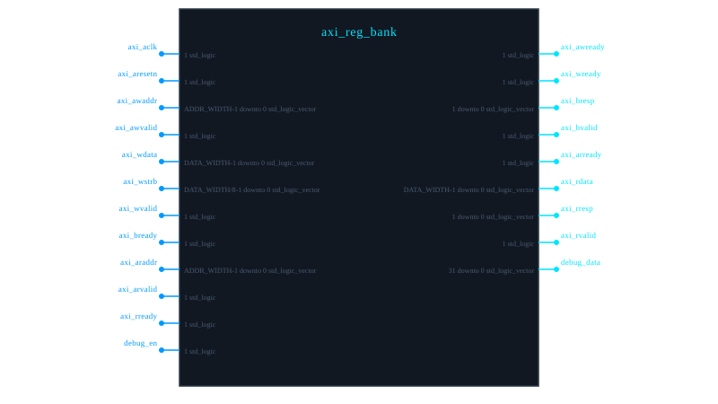

# Module Documentation

## Table of Contents

- [axi_reg_bank <code>TOP</code>](#axi_reg_bank)

---

# axi_reg_bank <code>TOP</code>

**File:** `C:/COGENT/bin/tests_VHDL\alu.vhd`

---

## Module Diagram

---

## Module Information

| Property | Value |
|----------|-------|
| **Date** | 2023-10-25 |
| **Status** | **[PENDING]** stable |

---

## Description

Parameterized AXI-Lite Register Bank

---

## Parameters

| Name | Default | 
|------|------|
| `REG_COUNT` | `16` | 
| `DATA_WIDTH` | `32` | 
| `ADDR_WIDTH` | `4` | 
| `INIT_PATTERN` | `XDEADBEEF` | 
| `ENABLE_DEBUG` | `true` | 

---

## Ports

| Name | Direction | Type | Width | 
|------|------|------|------|
| `axi_aclk` |  <->  in | std_logic | 1 | 
| `axi_aresetn` |  <->  in | std_logic | 1 | 
| `axi_awaddr` |  <->  in | std_logic_vector | ADDR_WIDTH-1 downto 0 | 
| `axi_awvalid` |  <->  in | std_logic | 1 | 
| `axi_awready` |  <- out | std_logic | 1 | 
| `axi_wdata` |  <->  in | std_logic_vector | DATA_WIDTH-1 downto 0 | 
| `axi_wstrb` |  <->  in | std_logic_vector | DATA_WIDTH/8-1 downto 0 | 
| `axi_wvalid` |  <->  in | std_logic | 1 | 
| `axi_wready` |  <- out | std_logic | 1 | 
| `axi_bresp` |  <- out | std_logic_vector | 1 downto 0 | 
| `axi_bvalid` |  <- out | std_logic | 1 | 
| `axi_bready` |  <->  in | std_logic | 1 | 
| `axi_araddr` |  <->  in | std_logic_vector | ADDR_WIDTH-1 downto 0 | 
| `axi_arvalid` |  <->  in | std_logic | 1 | 
| `axi_arready` |  <- out | std_logic | 1 | 
| `axi_rdata` |  <- out | std_logic_vector | DATA_WIDTH-1 downto 0 | 
| `axi_rresp` |  <- out | std_logic_vector | 1 downto 0 | 
| `axi_rvalid` |  <- out | std_logic | 1 | 
| `axi_rready` |  <->  in | std_logic | 1 | 
| `debug_en` |  <->  in | std_logic | 1 | 
| `debug_data` |  <- out | std_logic_vector | 31 downto 0 | 

---

## Warnings

> **Warning:** Reset is asynchronous and active low

---

## TODO

- [ ] Add ECC support for register storage

---

---

*Documentation generated automatically by COGENT*
