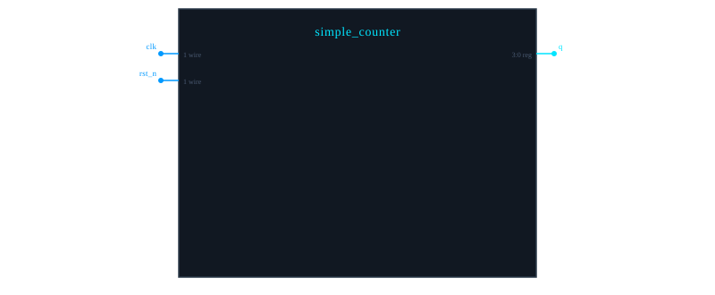
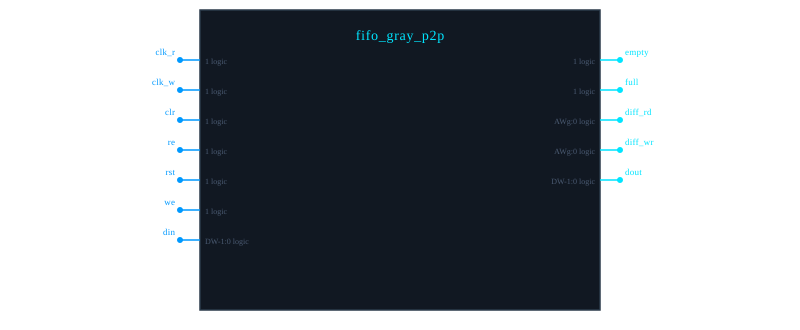
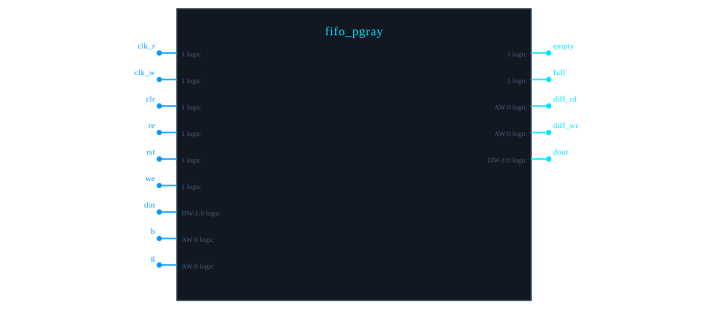
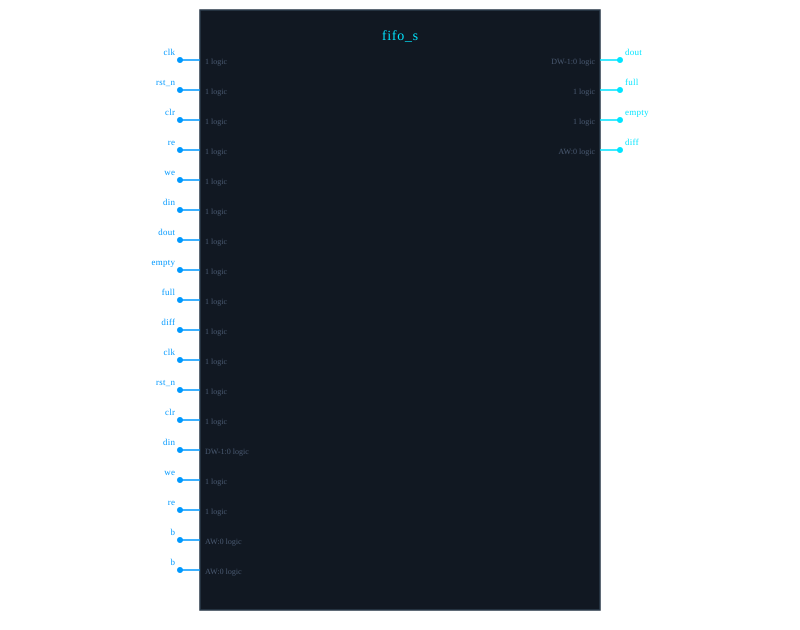
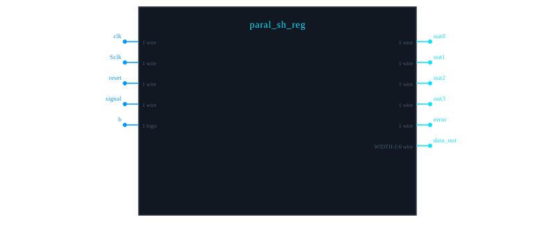
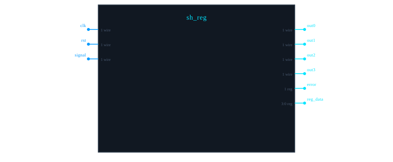

# Module Documentation

## Table of Contents

- [simple_counter](#simple_counter)
- [fifo_gray_p2p](#fifo_gray_p2p)
- [fifo_pgray](#fifo_pgray)
- [fifo_s](#fifo_s)
- [paral_sh_reg <code>TOP</code>](#paral_sh_reg)
- [sh_reg](#sh_reg)

---

# simple_counter

**File:** `tests_verilog\counter.v`

---

## Module Diagram

---

## Module Information

| Property | Value |
|----------|-------|
| **Status** | **[COMPLETE]** Verified in simulation |
| **Author** | Nikolaenkov Dmitry. Email: dimanik116@gmail.com |
| **Date** | 11.11.2025 |

---

## Description

4-bit up-counter with synchronous reset   This module implements a basic 4-bit binary counter that increments on every positive clock edge. The counter wraps around from 15 to 0 automatically.   A synchronous active-low reset allows initialization to zero when rst_n is low.

---

## Ports

| Name | Direction | Type | Width | Clock | Description | 
|------|------|------|------|------|------|
| `clk` | ->  input | wire | 1 |  100MHZ |  Clock, signal | 
| `rst_n` | ->  input | wire | 1 |  - |  Active-low synchronous reset | 
| `q` |  <- output | reg | 3:0 |  - |  4-bit counter output | 

---

## Notes

> **Note:** This counter uses synchronous reset which provides  better timing closure and predictability.   The initial block ensures simulation starts from known state but  may not synthesize to hardware initialization in all tools.

---

## Warnings

> **Warning:** If rst_n is not properly synchronized to clk,   metastability issues may occur when reset is released near clock edge.

---

# fifo_gray_p2p

**File:** `tests_verilog\fifo_gray_p2p.v`

---

## Module Diagram

---

## Description

test

---

## Parameters

| Name | Type | Default | 
|------|------|------|
| `DW` | parameter | `32` | 
| `AWg` | parameter | `4` | 
| `AWs` | parameter | `2` | 

---

## Ports

| Name | Direction | Type | Width | 
|------|------|------|------|
| `clk_r` | ->  input | logic | 1 | 
| `clk_w` | ->  input | logic | 1 | 
| `clr` | ->  input | logic | 1 | 
| `re` | ->  input | logic | 1 | 
| `rst` | ->  input | logic | 1 | 
| `we` | ->  input | logic | 1 | 
| `din` | ->  input | logic | DW-1:0 | 
| `empty` |  <- output | logic | 1 | 
| `full` |  <- output | logic | 1 | 
| `diff_rd` |  <- output | logic | AWg:0 | 
| `diff_wr` |  <- output | logic | AWg:0 | 
| `dout` |  <- output | logic | DW-1:0 | 

---

# fifo_pgray

**File:** `tests_verilog\fifo_pgray.v`

---

## Module Diagram

---

## Parameters

| Name | Type | Default | 
|------|------|------|
| `DW` | parameter | `2` | 
| `AW` | parameter | `5` | 
| `R_EMPTY` | parameter | `0` | 
| `R_FULL` | parameter | `0` | 
| `R_DAT` | parameter | `0` | 
| `MS` | localparam | `1` | 

---

## Ports

| Name | Direction | Type | Width | 
|------|------|------|------|
| `clk_r` | ->  input | logic | 1 | 
| `clk_w` | ->  input | logic | 1 | 
| `clr` | ->  input | logic | 1 | 
| `re` | ->  input | logic | 1 | 
| `rst` | ->  input | logic | 1 | 
| `we` | ->  input | logic | 1 | 
| `din` | ->  input | logic | DW-1:0 | 
| `empty` |  <- output | logic | 1 | 
| `full` |  <- output | logic | 1 | 
| `diff_rd` |  <- output | logic | AW:0 | 
| `diff_wr` |  <- output | logic | AW:0 | 
| `dout` |  <- output | logic | DW-1:0 | 
| `b` | ->  input | logic | AW:0 | 
| `g` | ->  input | logic | AW:0 | 

---

# fifo_s

**File:** `tests_verilog\fifo_s.v`

---

## Module Diagram

---

## Parameters

| Name | Type | Default | 
|------|------|------|
| `DW` | parameter | `32` | 
| `AW` | parameter | `4` | 
| `R_DAT` | parameter | `0` | 

---

## Ports

| Name | Direction | Type | Width | 
|------|------|------|------|
| `clk` | ->  input | logic | 1 | 
| `rst_n` | ->  input | logic | 1 | 
| `clr` | ->  input | logic | 1 | 
| `re` | ->  input | logic | 1 | 
| `we` | ->  input | logic | 1 | 
| `din` | ->  input | logic | 1 | 
| `dout` | ->  input | logic | 1 | 
| `empty` | ->  input | logic | 1 | 
| `full` | ->  input | logic | 1 | 
| `diff` | ->  input | logic | 1 | 
| `clk` | ->  input | logic | 1 | 
| `rst_n` | ->  input | logic | 1 | 
| `clr` | ->  input | logic | 1 | 
| `din` | ->  input | logic | DW-1:0 | 
| `dout` |  <- output | logic | DW-1:0 | 
| `we` | ->  input | logic | 1 | 
| `re` | ->  input | logic | 1 | 
| `full` |  <- output | logic | 1 | 
| `empty` |  <- output | logic | 1 | 
| `diff` |  <- output | logic | AW:0 | 
| `b` | ->  input | logic | AW:0 | 
| `b` | ->  input | logic | AW:0 | 

---

# paral_sh_reg <code>TOP</code>

**File:** `tests_verilog\paral_sh_reg.v`

---

## Module Diagram

---

## Parameters

| Name | Type | Default | 
|------|------|------|
| `WIDTH` | parameter | `32` | 
| `IN_WIDTH` | parameter | `4` | 

---

## Ports

| Name | Direction | Type | Width | 
|------|------|------|------|
| `clk` | ->  input | wire | 1 | 
| `Sclk` | ->  input | wire | 1 | 
| `reset` | ->  input | wire | 1 | 
| `signal` | ->  input | wire | 1 | 
| `out0` |  <- output | wire | 1 | 
| `out1` |  <- output | wire | 1 | 
| `out2` |  <- output | wire | 1 | 
| `out3` |  <- output | wire | 1 | 
| `error` |  <- output | wire | 1 | 
| `data_out` |  <- output | wire | WIDTH-1:0 | 
| `b` | ->  input | logic | 1 | 

---

# sh_reg

**File:** `tests_verilog\sh_reg.v`

---

## Module Diagram

---

## Ports

| Name | Direction | Type | Width | 
|------|------|------|------|
| `clk` | ->  input | wire | 1 | 
| `rst` | ->  input | wire | 1 | 
| `signal` | ->  input | wire | 1 | 
| `out0` |  <- output | wire | 1 | 
| `out1` |  <- output | wire | 1 | 
| `out2` |  <- output | wire | 1 | 
| `out3` |  <- output | wire | 1 | 
| `error` |  <- output | reg | 1 | 
| `reg_data` |  <- output | reg | 3:0 | 

---

---

*Documentation generated automatically by COGENT*
